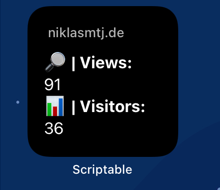

# Simple Analytics iOS Widget

This [scriptable](https://scriptable.app) widget will show you your Simple Analytics pageviews and visitors for the last month of a chosen domain. 

## How to install

1. Load the scriptable app for you device
2. Copy the content of the `getSimpleAnalyticsStats.js` file and fill in the first 3 lines of the file with your apiKey, userId and the domain you want to track. You can get your keys in your account settings https://simpleanalytics.com/account
3. Try to run the script and see if everything works.
4. Go back to your homescreen and trigger the "jiggle-mode"
5. Now add scriptable and chose your newly created script
6. Have fun with your Simple Analytics iOS widget